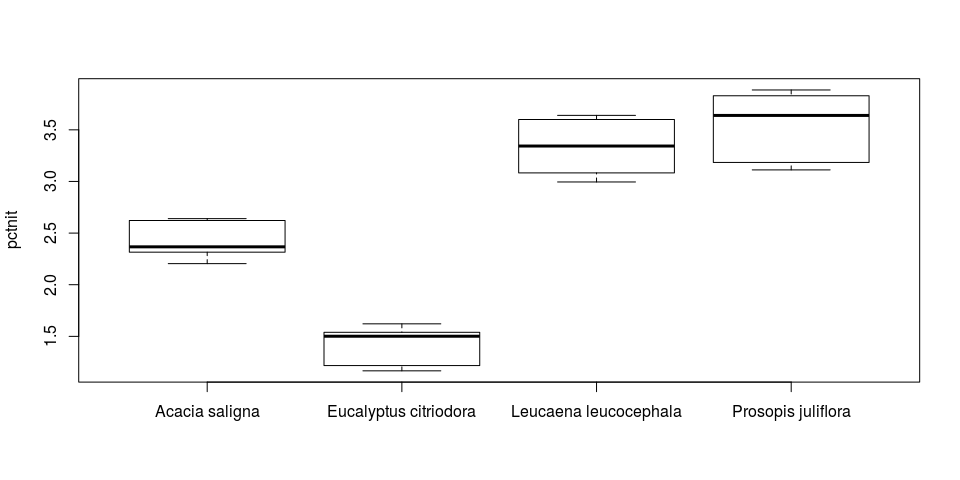

Постановка задачи
=================

Четыре вида растений: Leucaena leucocephala, Acacia saligna, Prosopis juliflora, Eucalyptus citriodora, которые могут расти в долине реки Иордан, где климат достаточно засушливый, выращивались в лаборатории при разных условиях доступа к воде. Количество воды, получаемой растением в сутки, менялось в разных группах от 50 до 650 мм с шагом 100 мм. Исследователей интересовала возможность их использования для кормления сельскохозяйственных животных, для чего необходимо высокое содержание азота. Для 9 растений в каждой группе известно содержание азота.

-   Как содержание азота меняется для разных видов растений при разных условиях выращивания?
-   Какие растения лучше всего подходят для сельскохозяйственного использования?

Вступление
==========

Загрузка данных.

``` r
plants = read.csv("plants.csv", sep = ";", header = T, dec=",", colClasses = c("pctnit"="numeric"))
leucaena = subset(plants, species=="Leucaena leucocephala")
acacia = subset(plants, species=="Acacia saligna")
eucalyptus = subset(plants, species=="Eucalyptus citriodora")
prosopis = subset(plants, species=="Prosopis juliflora")
```

Данные очень хорошо подходят для исследований и доказательства различных гипотез: размер каждой группы растений одинаков и равен 63.

``` r
sapply(unique(plants$species), function(t) dim(plants[plants$species==t,])[1])
```

    ## [1] 63 63 63 63

И количество замеров азота тоже равно по каждому растению и по каждому уровню воды и равно 9. Здесь можно видеть матрицу сопряжённости. Для четырёх групп растений и семи групп уровней воды. Все ячейки содержат одинаковое число элементов, что гарантирует корректное проведение двухфакторного дисперсионного анализа.

``` r
sapply(unique(plants$species), function(name) sapply(seq(50, 650, 100), function(level) dim(plants[plants$species==name & plants$water==level,])[1]))
```

    ##      [,1] [,2] [,3] [,4]
    ## [1,]    9    9    9    9
    ## [2,]    9    9    9    9
    ## [3,]    9    9    9    9
    ## [4,]    9    9    9    9
    ## [5,]    9    9    9    9
    ## [6,]    9    9    9    9
    ## [7,]    9    9    9    9

Первый вопрос
=============

Как содержание азота меняется для разных видов растений при разных условиях выращивания. Требуется найти благоприятные условия выращивания растений.

Исследуем, как меняется содержание азота при разных условиях для всех растений в совокупности. Проведём двухфакторный анализ учитывая взаимодействие факторов: уровня воды и вида растения. Вид растения существенно влияет на содержание азота *α* &lt; 2 \* 10<sup>−16</sup>, уровень воды влияет несущественно *α* = 0.118. Однако между этими двумя факторами есть взаимодействие *α* = 2.71 \* 10<sup>−9</sup>!

``` r
boxplot(pctnit ~ water*species, plants, ylab="pctnit")
```


``` r
boxplot(pctnit ~ water, plants, ylab="pctnit", xlab="water")
```


``` r
boxplot(pctnit ~ species, plants, ylab="pctnit", xlab="species")
```


``` r
summary(aov(pctnit ~ species*water, plants))
```

    ##                Df Sum Sq Mean Sq F value   Pr(>F)    
    ## species         3 172.39   57.46 978.098  < 2e-16 ***
    ## water           1   0.14    0.14   2.465    0.118    
    ## species:water   3   2.74    0.91  15.561 2.71e-09 ***
    ## Residuals     244  14.34    0.06                     
    ## ---
    ## Signif. codes:  0 '***' 0.001 '**' 0.01 '*' 0.05 '.' 0.1 ' ' 1

Дальше разобьём выборку на группы по растениям и проведём анализ отдельно для каждого. Применим дисперсионный анализ. Построим таблицы для среднего показателя азота. Нарисуем графики для визуальной качественной оценки. Применим критерий HSD Тьюки для попарного сравнения уровней воды по содержанию азота для статистического обоснования принятия решения. Результаты HSD показывают, что найденный лучший уровень воды значимо отличается от большинства остальных. В каждой группе оставим замеры при оптимальных условиях: для уровня, на котором растение вбирает наибольшее количество азота.

### Leucaena leucocephala

Благоприятные условия для leucaena: 650*м**м* воды.

``` r
boxplot(pctnit~water, leucaena)
```


``` r
a1 = aov(pctnit ~ as.factor(water), leucaena)
TukeyHSD(a1)
```

    ##   Tukey multiple comparisons of means
    ##     95% family-wise confidence level
    ## 
    ## Fit: aov(formula = pctnit ~ as.factor(water), data = leucaena)
    ## 
    ## $`as.factor(water)`
    ##                diff          lwr         upr     p adj
    ## 150-50  -0.49077778 -0.729936126 -0.25161943 0.0000011
    ## 250-50  -0.41144444 -0.650602793 -0.17228610 0.0000463
    ## 350-50  -0.31811111 -0.557269459 -0.07895276 0.0027152
    ## 450-50  -0.20244444 -0.441602793  0.03671390 0.1492178
    ## 550-50  -0.15800000 -0.397158348  0.08115835 0.4138736
    ## 650-50   0.07911111 -0.160047237  0.31826946 0.9492485
    ## 250-150  0.07933333 -0.159825015  0.31849168 0.9485779
    ## 350-150  0.17266667 -0.066491681  0.41182501 0.3079762
    ## 450-150  0.28833333  0.049174985  0.52749168 0.0087758
    ## 550-150  0.33277778  0.093619430  0.57193613 0.0014834
    ## 650-150  0.56988889  0.330730541  0.80904724 0.0000000
    ## 350-250  0.09333333 -0.145825015  0.33249168 0.8937416
    ## 450-250  0.20900000 -0.030158348  0.44815835 0.1246210
    ## 550-250  0.25344444  0.014286096  0.49260279 0.0310507
    ## 650-250  0.49055556  0.251397207  0.72971390 0.0000011
    ## 450-350  0.11566667 -0.123491681  0.35482501 0.7558185
    ## 550-350  0.16011111 -0.079047237  0.39926946 0.3976899
    ## 650-350  0.39722222  0.158063874  0.63638057 0.0000887
    ## 550-450  0.04444444 -0.194713904  0.28360279 0.9974562
    ## 650-450  0.28155556  0.042397207  0.52071390 0.0113318
    ## 650-550  0.23711111 -0.002047237  0.47626946 0.0534165

``` r
summary(a1)
```

    ##                  Df Sum Sq Mean Sq F value   Pr(>F)    
    ## as.factor(water)  6  2.353  0.3921   14.25 8.92e-10 ***
    ## Residuals        56  1.541  0.0275                     
    ## ---
    ## Signif. codes:  0 '***' 0.001 '**' 0.01 '*' 0.05 '.' 0.1 ' ' 1

``` r
q1 = unlist(model.tables(a1, type="mean")$tables[1])
m1 = unlist(model.tables(a1, type="mean")$tables[2])
e1 = unlist(model.tables(a1, type="effects")$tables)
names(m1) = seq(50, 650, 100)
names(e1) = seq(50, 650, 100)
m1
```

    ##       50      150      250      350      450      550      650 
    ## 3.254333 2.763556 2.842889 2.936222 3.051889 3.096333 3.333444

### Acacia saligna

Благоприятные условия для acacia: 50*м**м* воды.

``` r
boxplot(pctnit ~ water, acacia)
```


``` r
a2 = aov(pctnit ~ as.factor(water), acacia)
TukeyHSD(a2)
```

    ##   Tukey multiple comparisons of means
    ##     95% family-wise confidence level
    ## 
    ## Fit: aov(formula = pctnit ~ as.factor(water), data = acacia)
    ## 
    ## $`as.factor(water)`
    ##                 diff          lwr         upr     p adj
    ## 150-50  -0.371333333 -0.639782151 -0.10288452 0.0016097
    ## 250-50  -0.369111111 -0.637559929 -0.10066229 0.0017477
    ## 350-50  -0.454222222 -0.722671040 -0.18577340 0.0000632
    ## 450-50  -0.465555556 -0.734004373 -0.19710674 0.0000398
    ## 550-50  -0.437666667 -0.706115484 -0.16921785 0.0001234
    ## 650-50  -0.203111111 -0.471559929  0.06533771 0.2558598
    ## 250-150  0.002222222 -0.266226596  0.27067104 1.0000000
    ## 350-150 -0.082888889 -0.351337707  0.18555993 0.9634419
    ## 450-150 -0.094222222 -0.362671040  0.17422660 0.9332992
    ## 550-150 -0.066333333 -0.334782151  0.20211548 0.9881266
    ## 650-150  0.168222222 -0.100226596  0.43667104 0.4785028
    ## 350-250 -0.085111111 -0.353559929  0.18333771 0.9584814
    ## 450-250 -0.096444444 -0.364893262  0.17200437 0.9259127
    ## 550-250 -0.068555556 -0.337004373  0.19989326 0.9859038
    ## 650-250  0.166000000 -0.102448818  0.43444882 0.4946765
    ## 450-350 -0.011333333 -0.279782151  0.25711548 0.9999996
    ## 550-350  0.016555556 -0.251893262  0.28500437 0.9999958
    ## 650-350  0.251111111 -0.017337707  0.51955993 0.0811579
    ## 550-450  0.027888889 -0.240559929  0.29633771 0.9999094
    ## 650-450  0.262444444 -0.006004373  0.53089326 0.0593546
    ## 650-550  0.234555556 -0.033893262  0.50300437 0.1247495

``` r
summary(a2)
```

    ##                  Df Sum Sq Mean Sq F value   Pr(>F)    
    ## as.factor(water)  6  1.563 0.26044    7.51 6.24e-06 ***
    ## Residuals        56  1.942 0.03468                     
    ## ---
    ## Signif. codes:  0 '***' 0.001 '**' 0.01 '*' 0.05 '.' 0.1 ' ' 1

``` r
q2 = unlist(model.tables(a2, type="mean")$tables[1])
m2 = unlist(model.tables(a2, type="mean")$tables[2])
e2 = unlist(model.tables(a2, type="effects")$tables)
names(m2) = seq(50, 650, 100)
names(e2) = seq(50, 650, 100)
m2
```

    ##       50      150      250      350      450      550      650 
    ## 2.421556 2.050222 2.052444 1.967333 1.956000 1.983889 2.218444

### Eucalyptus citriodora.

Благоприятные условия для eucalyptus: 50*м**м* воды.

``` r
boxplot(pctnit ~ water, eucalyptus)
```


``` r
a3 = aov(pctnit ~ as.factor(water), eucalyptus)
TukeyHSD(a3)
```

    ##   Tukey multiple comparisons of means
    ##     95% family-wise confidence level
    ## 
    ## Fit: aov(formula = pctnit ~ as.factor(water), data = eucalyptus)
    ## 
    ## $`as.factor(water)`
    ##                diff          lwr          upr     p adj
    ## 150-50  -0.11933333 -0.389144738  0.150478071 0.8239125
    ## 250-50  -0.29766667 -0.567478071 -0.027855262 0.0216038
    ## 350-50  -0.41433333 -0.684144738 -0.144521929 0.0003381
    ## 450-50  -0.16455556 -0.434366960  0.105255849 0.5113678
    ## 550-50  -0.15177778 -0.421589182  0.118033627 0.6057438
    ## 650-50  -0.44422222 -0.714033627 -0.174410818 0.0001038
    ## 250-150 -0.17833333 -0.448144738  0.091478071 0.4133092
    ## 350-150 -0.29500000 -0.564811404 -0.025188596 0.0234858
    ## 450-150 -0.04522222 -0.315033627  0.224589182 0.9985726
    ## 550-150 -0.03244444 -0.302255849  0.237366960 0.9997872
    ## 650-150 -0.32488889 -0.594700293 -0.055077485 0.0088950
    ## 350-250 -0.11666667 -0.386478071  0.153144738 0.8386353
    ## 450-250  0.13311111 -0.136700293  0.402922515 0.7385096
    ## 550-250  0.14588889 -0.123922515  0.415700293 0.6489058
    ## 650-250 -0.14655556 -0.416366960  0.123255849 0.6440577
    ## 450-350  0.24977778 -0.020033627  0.519589182 0.0870042
    ## 550-350  0.26255556 -0.007255849  0.532366960 0.0614212
    ## 650-350 -0.02988889 -0.299700293  0.239922515 0.9998681
    ## 550-450  0.01277778 -0.257033627  0.282589182 0.9999991
    ## 650-450 -0.27966667 -0.549478071 -0.009855262 0.0374795
    ## 650-550 -0.29244444 -0.562255849 -0.022633040 0.0254275

``` r
summary(a3)
```

    ##                  Df Sum Sq Mean Sq F value   Pr(>F)    
    ## as.factor(water)  6  1.440 0.23993   6.849 1.74e-05 ***
    ## Residuals        56  1.962 0.03503                     
    ## ---
    ## Signif. codes:  0 '***' 0.001 '**' 0.01 '*' 0.05 '.' 0.1 ' ' 1

``` r
q3 = unlist(model.tables(a3, type="mean")$tables[1])
m3 = unlist(model.tables(a3, type="mean")$tables[2])
e3 = unlist(model.tables(a3, type="effects")$tables)
names(m3) = seq(50, 650, 100)
names(e3) = seq(50, 650, 100)
m3
```

    ##        50       150       250       350       450       550       650 
    ## 1.4230000 1.3036667 1.1253333 1.0086667 1.2584444 1.2712222 0.9787778

### Prosopis juliflora.

Благоприятные условия для prosopis: 650*м**м* воды.

``` r
boxplot(pctnit ~ water, prosopis)
```


``` r
a4 = aov(pctnit ~ as.factor(water), prosopis)
TukeyHSD(a4)
```

    ##   Tukey multiple comparisons of means
    ##     95% family-wise confidence level
    ## 
    ## Fit: aov(formula = pctnit ~ as.factor(water), data = prosopis)
    ## 
    ## $`as.factor(water)`
    ##                diff          lwr       upr     p adj
    ## 150-50   0.09522222 -0.310979534 0.5014240 0.9910039
    ## 250-50   0.14144444 -0.264757312 0.5476462 0.9356637
    ## 350-50   0.08300000 -0.323201756 0.4892018 0.9957088
    ## 450-50   0.33666667 -0.069535089 0.7428684 0.1669619
    ## 550-50   0.43722222  0.031020466 0.8434240 0.0270706
    ## 650-50   0.48477778  0.078576022 0.8909795 0.0098000
    ## 250-150  0.04622222 -0.359979534 0.4524240 0.9998457
    ## 350-150 -0.01222222 -0.418423978 0.3939795 0.9999999
    ## 450-150  0.24144444 -0.164757312 0.6476462 0.5421328
    ## 550-150  0.34200000 -0.064201756 0.7482018 0.1536329
    ## 650-150  0.38955556 -0.016646201 0.7957573 0.0682551
    ## 350-250 -0.05844444 -0.464646201 0.3477573 0.9994007
    ## 450-250  0.19522222 -0.210979534 0.6014240 0.7611393
    ## 550-250  0.29577778 -0.110423978 0.7019795 0.2982418
    ## 650-250  0.34333333 -0.062868423 0.7495351 0.1504314
    ## 450-350  0.25366667 -0.152535089 0.6598684 0.4827115
    ## 550-350  0.35422222 -0.051979534 0.7604240 0.1261837
    ## 650-350  0.40177778 -0.004423978 0.8079795 0.0543812
    ## 550-450  0.10055556 -0.305646201 0.5067573 0.9880125
    ## 650-450  0.14811111 -0.258090645 0.5543129 0.9208619
    ## 650-550  0.04755556 -0.358646201 0.4537573 0.9998179

``` r
summary(a4)
```

    ##                  Df Sum Sq Mean Sq F value  Pr(>F)   
    ## as.factor(water)  6  1.976  0.3294   4.149 0.00162 **
    ## Residuals        56  4.446  0.0794                   
    ## ---
    ## Signif. codes:  0 '***' 0.001 '**' 0.01 '*' 0.05 '.' 0.1 ' ' 1

``` r
q4 = unlist(model.tables(a4, type="mean")$tables[1])
m4 = unlist(model.tables(a4, type="mean")$tables[2])
e4 = unlist(model.tables(a4, type="effects")$tables)
names(m4) = seq(50, 650, 100)
names(e4) = seq(50, 650, 100)
m4
```

    ##       50      150      250      350      450      550      650 
    ## 3.058889 3.154111 3.200333 3.141889 3.395556 3.496111 3.543667

Второй вопрос
=============

Требуется определить оптимальные для выращивания растения. Для каждого растения выберем оптимальный для него уровень воды.

``` r
plants = subset(plants, species=="Leucaena leucocephala" & water==650 | species=="Acacia saligna" & water==50 | species=="Eucalyptus citriodora" & water==50 | species=="Prosopis juliflora" & water==650)[, -2]
```

Дальше попарно сравним распределения азота по растениям. Тогда leucaena и prosopis содержат наибольшее среднее содержание азота соответственно: 3.333% и 3.544%. Против 1.423% и 2.422% eucalyptus и acacia. Однако leucaena и prosopis не различаются значимо статистически. Остальные же пары отличаются между собой по критерию. Тогда для сельскохозяйственного использования лучше всего подходят как leucaena, так и prosopis, при достаточном для них уровне воды в 650*м**м*.

``` r
boxplot(pctnit~species, plants, ylab="pctnit")
```



``` r
a5 = aov(pctnit~species, plants)
TukeyHSD(a5)
```

    ##   Tukey multiple comparisons of means
    ##     95% family-wise confidence level
    ## 
    ## Fit: aov(formula = pctnit ~ species, data = plants)
    ## 
    ## $species
    ##                                                   diff         lwr
    ## Eucalyptus citriodora-Acacia saligna        -0.9985556 -1.29551699
    ## Leucaena leucocephala-Acacia saligna         0.9118889  0.61492745
    ## Prosopis juliflora-Acacia saligna            1.1221111  0.82514967
    ## Leucaena leucocephala-Eucalyptus citriodora  1.9104444  1.61348301
    ## Prosopis juliflora-Eucalyptus citriodora     2.1206667  1.82370523
    ## Prosopis juliflora-Leucaena leucocephala     0.2102222 -0.08673922
    ##                                                    upr     p adj
    ## Eucalyptus citriodora-Acacia saligna        -0.7015941 0.0000000
    ## Leucaena leucocephala-Acacia saligna         1.2088503 0.0000000
    ## Prosopis juliflora-Acacia saligna            1.4190725 0.0000000
    ## Leucaena leucocephala-Eucalyptus citriodora  2.2074059 0.0000000
    ## Prosopis juliflora-Eucalyptus citriodora     2.4176281 0.0000000
    ## Prosopis juliflora-Leucaena leucocephala     0.5071837 0.2408489

``` r
summary(a5)
```

    ##             Df Sum Sq Mean Sq F value Pr(>F)    
    ## species      3  25.38   8.459   156.5 <2e-16 ***
    ## Residuals   32   1.73   0.054                   
    ## ---
    ## Signif. codes:  0 '***' 0.001 '**' 0.01 '*' 0.05 '.' 0.1 ' ' 1

``` r
q5 = unlist(model.tables(a5, type="mean")$tables[1])
m5 = unlist(model.tables(a5, type="mean")$tables[2])
e5 = unlist(model.tables(a5, type="effects")$tables)
m5
```

    ##        species.Acacia saligna species.Eucalyptus citriodora 
    ##                      2.421556                      1.423000 
    ## species.Leucaena leucocephala    species.Prosopis juliflora 
    ##                      3.333444                      3.543667

Выводы
======

Графически отобразим зависимость средней доли азота по уровням воды для всех видов растений. Сформулируем ответы к поставленной задаче. Самое лучшее для зверей растение -- Prosopis juliflora. Наиболее благоприятный уровень воды для Prosopis juliflora: 650*м**м*. Для Leucaena leucocephala благоприятный уровень: 650*м**м*. И это растение на втором месте по пригодности после Prosopis juliflora. На третьем -- Acacia saligna. И благоприятный уровень воды для неё: 50*м**м*. На последнем -- Eucalyptus citriodora. Эвкалипт хорошо собирает азот при уровнях воды в 50*м**м*.

``` r
x = seq(50, 650, 100)
par(mar=c(5, 4, 4, 15), xpd=TRUE)
plot(x, m1, col="red", pch=8, main="mean pctnit for all kind of water levels", ylim=c(1,3.5))
points(x, m2, pch=8, col="green")
points(x, m3, pch=8, col="brown")
points(x, m4, pch=8,  col="blue")
legend("topright", inset=c(-0.4,0), legend=c("Leucaena leucocephala", "Acacia saligna", "Eucalyptus citriodora", "Prosopis juliflora"), pch=c(8,8,8,8), col=c("red", "green", "brown", "blue"), title="species")
```


Уровни воды: 50, 150, 250, 350, 450, 550, 650.

*l**e**u**c**a**e**n**a*

-   Распределение азота по уровням: 3.2543333, 2.7635556, 2.8428889, 2.9362222, 3.0518889, 3.0963333, 3.3334444;
-   Среднее содержание азота: 3.0398095;
-   Отклонение азота от среднего: 0.2145238, -0.276254, -0.1969206, -0.1035873, 0.0120794, 0.0565238, 0.2936349;
-   Благоприятные условия для acacia: 650 мм воды;

*a**c**a**c**i**a*

-   Распределение азота по уровням: 2.4215556, 2.0502222, 2.0524444, 1.9673333, 1.956, 1.9838889, 2.2184444;
-   Среднее содержание азота: 2.0928413;
-   Отклонение азота от среднего: 0.3287143, -0.042619, -0.0403968, -0.1255079, -0.1368413, -0.1089524, 0.1256032;
-   Благоприятные условия для acacia: 50 мм воды;

*e**u**c**a**l**y**p**t**u**s*

-   Распределение азота по уровням: 1.423, 1.3036667, 1.1253333, 1.0086667, 1.2584444, 1.2712222, 0.9787778;
-   Среднее содержание азота: 1.1955873;
-   Отклонение азота от среднего: 0.2274127, 0.1080794, -0.070254, -0.1869206, 0.0628571, 0.0756349, -0.2168095;
-   Благоприятные условия для acacia: 50 мм воды;

*p**r**o**s**o**p**i**s*

-   Распределение азота по уровням: 3.0588889, 3.1541111, 3.2003333, 3.1418889, 3.3955556, 3.4961111, 3.5436667;
-   Среднее содержание азота: 3.2843651;
-   Отклонение азота от среднего: -0.2254762, -0.130254, -0.0840317, -0.1424762, 0.1111905, 0.211746, 0.2593016;
-   Благоприятные условия для acacia: 650 мм воды;

``` r
barplot(m5, names.arg = c("Acacia saligna", "Eucalyptus citriodora", "Leucaena leucocephala", "Prosopis juliflora"))
```


Виды растений: "Leucaena leucocephala", "Acacia saligna", "Eucalyptus citriodora", "Prosopis juliflora".

-   Распределение азота по видам: 2.4215556, 1.423, 3.3334444, 3.5436667;
-   Среднее содержание азота: 2.6804167;
-   Отклонение азота от среднего: -0.2588611, -1.2574167, 0.6530278, 0.86325;

Лучшие растения для сельскохозяйственного использования: "Prosopis juliflora" и "Leucaena leucocephala". Больше всего азота в них достигается при уровне воды в 650*м**м*.

------------------------------------------------------------------------
